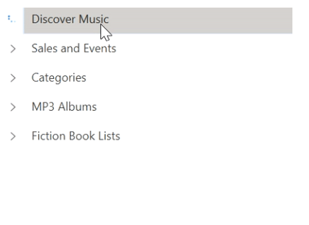

# How to Load Child Items on Demand in WPF TreeView?

This repository describes how to load child items on demand in [WPF TreeView](https://www.syncfusion.com/wpf-controls/treeview) (SfTreeView).

You can load child items for the node in [Execute](https://learn.microsoft.com/en-us/dotnet/api/system.windows.input.routedcommand.execute?view=netframework-4.0) method of `LoadOnDemandCommand`. Execute method will get called when user expands the tree node. In `LoadOnDemand.Execute` method, you have can perform following operations,

* Show or hide busy indicator in the place of expander by setting [TreeViewNode.ShowExpanderAnimation](https://help.syncfusion.com/cr/wpf/Syncfusion.UI.Xaml.TreeView.Engine.TreeViewNode.html#Syncfusion_UI_Xaml_TreeView_Engine_TreeViewNode_ShowExpanderAnimation) until the data fetched.
* Once data fetched, you can populate the child nodes by calling [TreeViewNode.PopulateChildNodes](https://help.syncfusion.com/cr/wpf/Syncfusion.UI.Xaml.TreeView.Engine.TreeViewNode.html#Syncfusion_UI_Xaml_TreeView_Engine_TreeViewNode_PopulateChildNodes_System_Collections_IEnumerable_) method by passing the child items collection.
* When load on-demand command executes expanding operation will not be handled by TreeView. So, you have to set [TreeViewNode.IsExpanded](https://help.syncfusion.com/cr/wpf/Syncfusion.UI.Xaml.TreeView.Engine.TreeViewNode.html#Syncfusion_UI_Xaml_TreeView_Engine_TreeViewNode_IsExpanded) property to true to expand the tree node after populating child nodes.
* You can skip population of child items again and again when every time the node expands, based on [TreeViewNode.ChildNodes](https://help.syncfusion.com/cr/wpf/Syncfusion.UI.Xaml.TreeView.Engine.TreeViewNode.html#Syncfusion_UI_Xaml_TreeView_Engine_TreeViewNode_ChildNodes) count.

``` csharp
/// <summary>
/// Execute method is called when any item is requested for load-on-demand items.
/// </summary>
/// <param name="obj">TreeViewNode is passed as default parameter </param>
private void ExecuteOnDemandLoading(object obj)
{
    var node = obj as TreeViewNode;

    // Skip the repeated population of child items when every time the node expands.
    if (node.ChildNodes.Count > 0)
    {
        node.IsExpanded = true;
        return;
    }

    //Animation starts for expander to show progressing of load on demand
    node.ShowExpanderAnimation = true;
    var sfTreeView = Application.Current.MainWindow.FindName("sfTreeView") as SfTreeView;
    sfTreeView.Dispatcher.BeginInvoke(DispatcherPriority.ApplicationIdle, new Action(() =>
    {
        currentNode = node;
        timer.Start();
    }));
}
```

